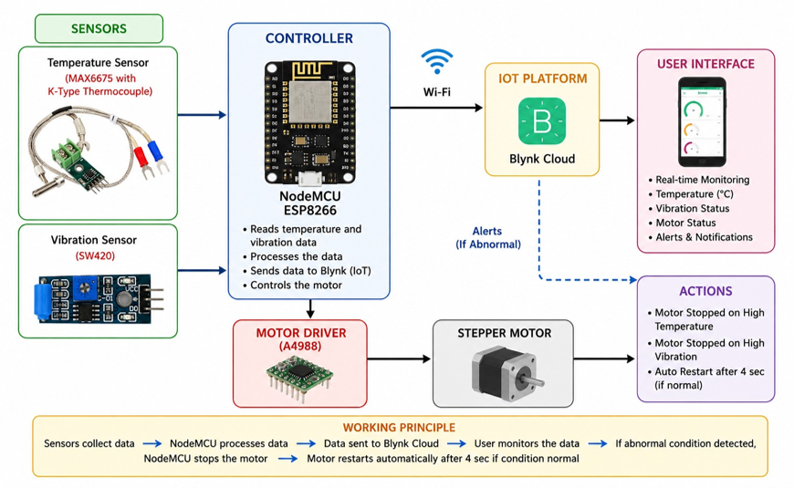
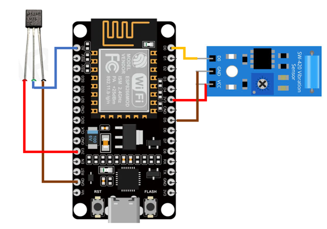
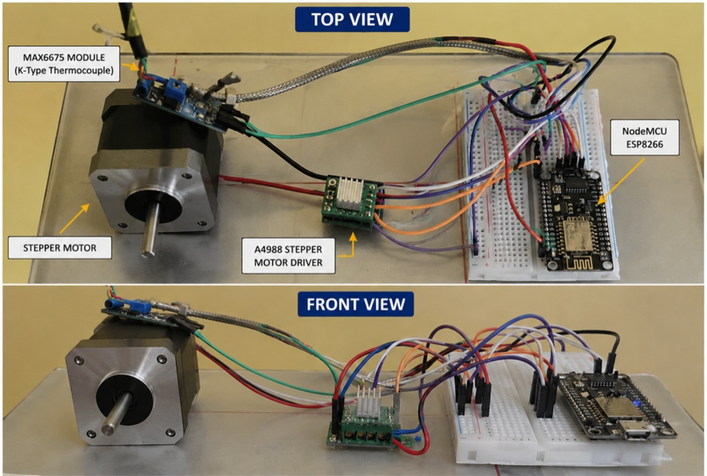
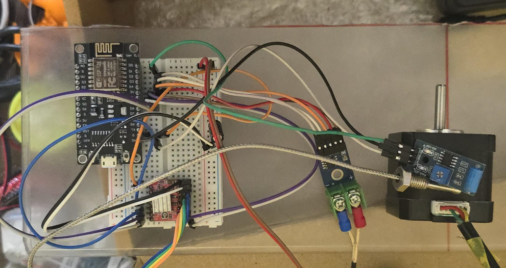
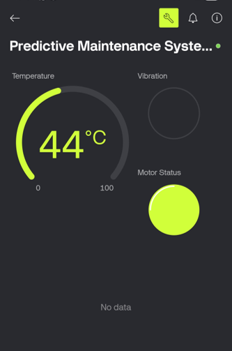

# Motor Predictive Maintenance System

A low-cost motor condition-monitoring system designed to detect abnormal operating conditions using temperature and vibration monitoring.

## Project Overview

This project was developed as a third-year Mechatronics Engineering project based on the concept of Condition-Based Maintenance (CBM) and Predictive Maintenance.

The system monitors motor operating conditions in real time and uses predefined safety thresholds to identify abnormal conditions. The project combines motor control, sensor monitoring, embedded programming, and IoT-based visualization.

## Objectives

- Monitor motor temperature and vibration in real time
- Detect abnormal operating conditions
- Provide an early warning mechanism for potential motor issues
- Demonstrate low-cost condition monitoring using embedded hardware
- Explore the application of IoT concepts in industrial maintenance

## Key Features

- Real-time temperature monitoring
- Vibration monitoring
- Stepper motor control
- ESP8266-based wireless connectivity
- Blynk-based monitoring
- Automatic motor shutdown under abnormal conditions
- Temperature safety threshold

## Hardware and Components

- ESP8266 development board
- NEMA 17 stepper motor
- Stepper motor driver
- MAX6675 thermocouple module
- Vibration sensor
- Power supply
- Connecting wires and supporting hardware

## Software and Technologies

- Arduino/C++
- ESP8266
- Blynk IoT platform
- MAX6675 thermocouple library

## Working Principle

1. The motor is operated using a stepper motor and driver.
2. The temperature of the motor is monitored using a MAX6675 thermocouple.
3. A vibration sensor monitors abnormal vibration conditions.
4. The ESP8266 processes the sensor inputs.
5. Temperature data is transmitted to the Blynk platform.
6. The system continuously checks the monitored conditions against predefined limits.
7. If the temperature exceeds the defined safety limit or abnormal vibration is detected, the motor is stopped.
8. The Blynk interface indicates the motor status.

## Safety Logic

The prototype uses threshold-based monitoring.

The motor is stopped when either:

- The measured temperature exceeds the predefined temperature limit.
- The vibration sensor detects a high vibration condition.

This provides a simple protective mechanism for abnormal operating conditions.

## Project Documentation

[View Project Documentation](Motor-Predictive-Maintenance.pdf)

## Project Images

### System Architecture

### Sensor Wiring

### Motor Setup

### Hardware Setup

### Blynk Dashboard

## Project Status

The project demonstrates a prototype approach to low-cost motor condition monitoring and IoT-enabled maintenance.

## Future Scope

Potential improvements include more detailed vibration analysis, additional sensing, historical data analysis, improved fault classification, and more advanced predictive-maintenance algorithms.

## Project Details

**Project Type:** Real-Time Research Based Project  
**Year:** Third Year B.Tech  
**Branch:** Mechatronics Engineering
